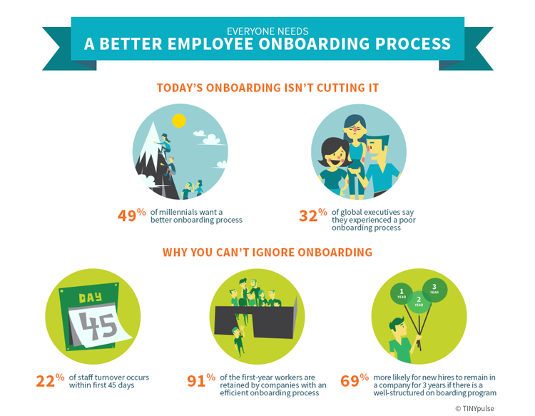
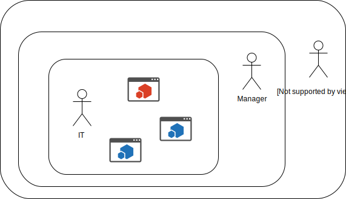
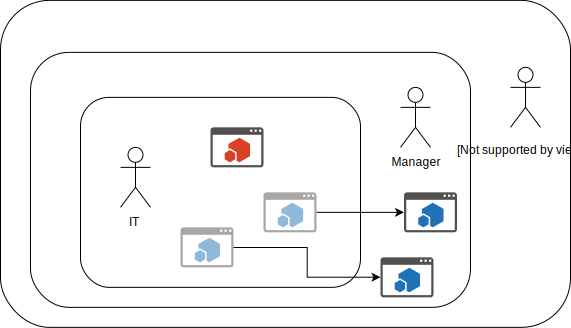
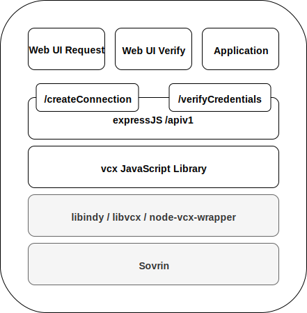
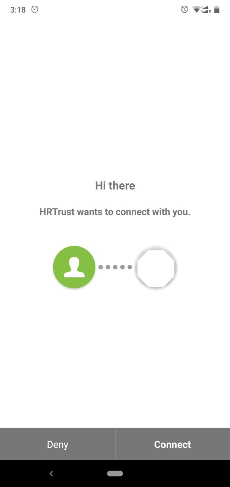
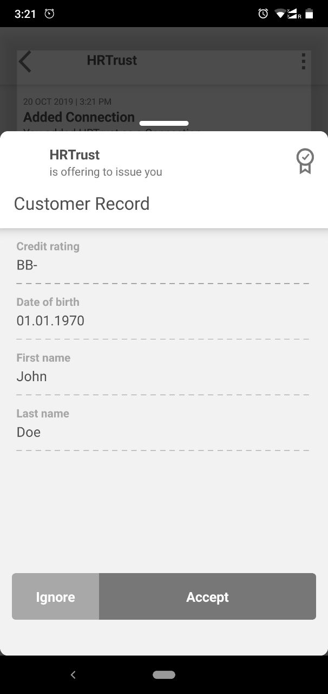
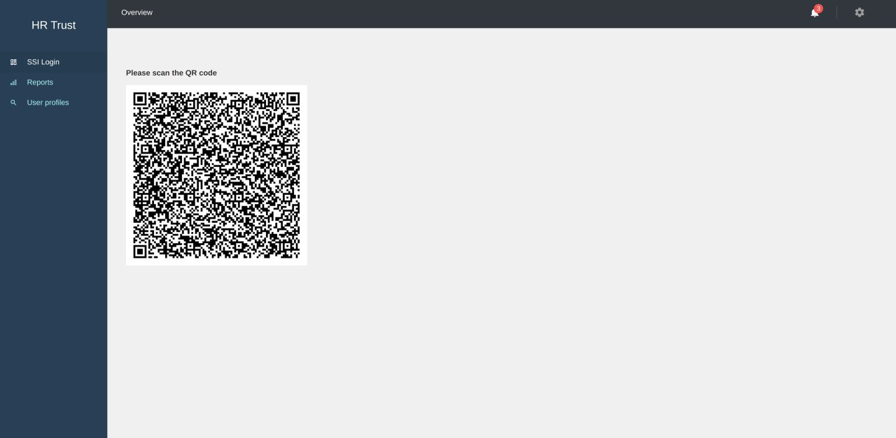
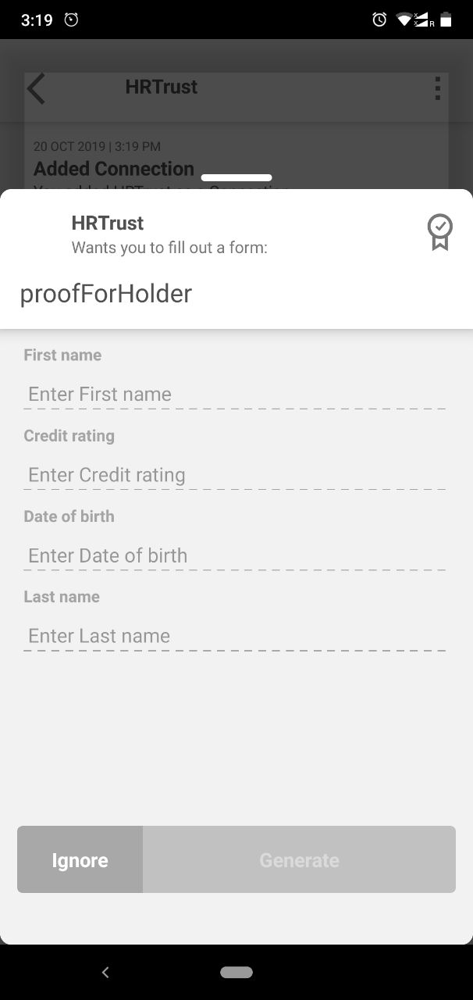
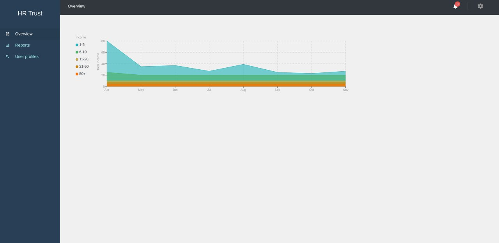

# Onboarding of external contractors made easy!

## Good onboarding is important

<!--  -->


Source: [blog.hubstaff.com](https://blog.hubstaff.com/employee-onboarding-best-practices/)

---

> Facebook has employees launch into their first projects within *45
> minutes* of starting with the company.


Source: [blog.hubstaff.com](https://blog.hubstaff.com/employee-onboarding-best-practices/)

# Current process

```{.render_plantuml args="-Sbackgroundcolor=grey -SdefaultFontSize=16"}
!include assets/onboarding-process.plantuml

```

# Forms, forms, forms

.. *slow down* the onboarding process of employees and *increase
frustration*.

## Who's affected by it

::::::::: incremental

- External contractors
- New employees
- Managers

:::::::::

# Solution?



<!-- ::::::::: {.columns} -->

<!-- :::{.column} -->

<!--  -->

<!-- ::: -->
<!-- :::{.column} -->

<!--  -->

<!-- ::: -->

<!-- ::::::::: -->

## Solution!


# Architecture



## New SSI-based onboarding process

```{.render_plantuml args="-Sbackgroundcolor=grey -SdefaultFontSize=16"}
@startuml
actor "External Contractor" as a_ex_employee
actor "Project Manager" as a_company_pm
actor "IT" as a_company_it
actor "Customer" as a_customer

a_company_it --> a_company_pm: Issue credential to be a trusted manager
a_customer -> a_company_pm: Order a new project
a_company_pm -> a_ex_employee: We need support

group Onboarding Software X
    a_ex_employee -> a_company_pm: I don't have access to the Dashboard
    a_company_pm -> a_ex_employee: Okay, here are your credentials
end

@enduml
```

## SSI-based authentication

```{.render_plantuml args="-Sbackgroundcolor=grey -SdefaultFontSize=16"}
@startuml
actor "External Contractor" as a_ex_employee
database "Application" as a_application
database "Sovrin Blockchain" as a_blockchain

a_ex_employee -> a_application: Access application
a_application -> a_ex_employee: Request credentials
a_ex_employee -> a_application: Confirm credentials request
a_application -> a_blockchain: View public identity details
a_application -> a_application: Verify credentials
a_application -> a_ex_employee: Grant/deny access

@enduml
```

# Demo

----



----



----



----



----



# Business

## Customers

- SMEs
- Corporates

## Business model

We're not sure yet.

::::::::: incremental

- Subscription?
- Usage?
- Definitely find early adopters who support development!

:::::::::

## Challenges

::::::::: incremental

- Taking away tasks from IT
- New paradigm for doing IT, user self-service
- Time it takes for changing existing processes

:::::::::

## Competition

::::::::: incremental

- SSO solutions like Auth0
- SELF (esatus)

:::::::::

## Future milestones

::::::::: incremental

- Integration with Slack, GitHub, Office365, Jira, Confluence
- Integration with Active Directory
- Defining/standardizing the schema for applications
- Hardening

:::::::::

# Thank you!

What do you think?
