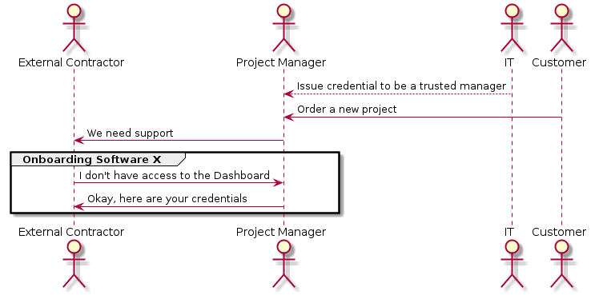

# Onboarding of external contractors made easy!

## Good onboarding is important

<!--  -->

Source: [blog.hubstaff.com](https://blog.hubstaff.com/employee-onboarding-best-practices/)

---

> Facebook has employees launch into their first projects within *45
> minutes* of starting with the company.

Source: [blog.hubstaff.com](https://blog.hubstaff.com/employee-onboarding-best-practices/)

# Current process

<!-- assets/onboarding-process.plantuml -->

{width=45%}

# Forms, forms, forms

.. *slow down* the onboarding process of employees and *increase
frustration*.

## Who's affected by it

::::::::: incremental

- External contractors
- New employees
- Managers

:::::::::

# Solution?

<!-- ::::::::: {.columns} -->

<!-- :::{.column} -->

<!--  -->

<!-- ::: -->
<!-- :::{.column} -->

<!--  -->

<!-- ::: -->

<!-- ::::::::: -->

## Solution!

# Architecture

## New SSI-based onboarding process

<!-- ./assets/new-onboarding-process.plantuml -->

{width=65%}

## SSI-based authentication

<!-- ./assets/ssi-auth.plantuml -->

{width=65%}

# Demo

----

----

----

----

----

# Business

## Customers

- SMEs
- Corporates

## Business model

We're not sure yet.

::::::::: incremental

- Subscription?
- Usage?
- Definitely find early adopters who support development!

:::::::::

## Challenges

::::::::: incremental

- Taking away tasks from IT
- New paradigm for doing IT, user self-service
- Time it takes for changing existing processes

:::::::::

## Competition

::::::::: incremental

- SSO solutions like Auth0
- SELF (esatus)

:::::::::

## Future milestones

::::::::: incremental

- Integration with Slack, GitHub, Office365, Jira, Confluence
- Integration with Active Directory
- Defining/standardizing the schema for applications
- Hardening

:::::::::

# Thank you!

What do you think?
